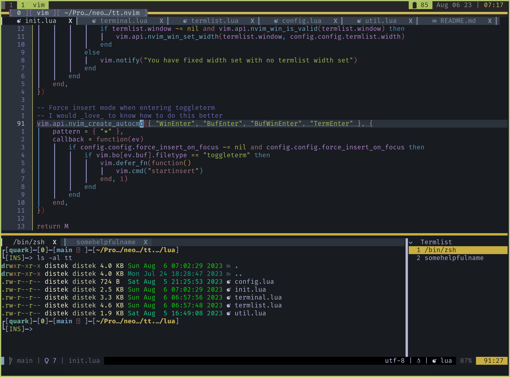

# tt.nvim

A little toggleterm with a terminal listing and clickable winbar tabs



## Installation

Via lazy:

```lua
	{
		"distek/tt.nvim",
		config = function()
			require("tt").setup({
				-- config
			})
		end
	},
```

## Default config

```lua
{
	focus_on_select = true, -- bool: focus terminal on termlist select

	force_insert_on_focus = true, -- bool: initially force insert mode when terminal is focused

	termlist = {
		enabled = true, -- bool: enable termlist
		side = "right", -- string: "right" or "left": which side the termlist is on
		width = 25, -- int: width of the termlist
	},
	winbar = {
		tabs = false, -- bool: show winbar tabs above terminal (not useful if using something like edgy.nvim)
		list = true, -- bool: show winbar above termlist
		list_title = "Terminals" -- string: the title to show above the termlist
	},

	height = 15, -- int: initial height of the toggle term and termlist

	fixed_height = false, -- bool: retain the height of the toggle term as set above
	fixed_width = true, -- bool: retain the width of the termlist as set above (termlist.width)

	pre_cb = nil, -- function|nil: pre-hook to run prior to opening the terminal
	post_cb = nil, -- function|nil: post-hook to run after opening the terminal
}
```

## Usage

The terminal has the filetype of `toggleterm`
The termlist has the filetype of `termlist`
Use the above for whatever autocmds you desire

An example configuration using lazy is located in [example](example/example-init.lua)

```lua
local t = require("tt")

-- Global functions:
t:IsOpen() -- bool: if terminal is open or not

-- Terminal specific functions:
t.terminal:NewTerminal(name: string, command: string) -- Open new terminal running command with name

t.terminal:Open("last"|idx: int) -- Open the "last" used terminal, or terminal at index "idx"
                                  -- Terminal's are tracked via t.terminal:TermList with
                                  -- t.terminal:TermListIdx being the current terminal's index

t.terminal:Toggle() -- Toggles the term

t.terminal:Close() -- Just closes the open toggle term window

t.terminal:Delete(idx: int) -- Closes the terminal at "idx". If it is the last terminal, closes the
                            -- window as well, otherwise it focuses the next terminal

t.terminal:FocusNext() -- Focus the next terminal
t.terminal:FocusPrevious() -- Focus the previous terminal


-- Termlist functions
t.termlist:UpdateTermList() -- Refreshes the current termlist (mostly just for t.terminal)

t.termlist:OpenTermUnderCursor() -- Opens the current term under cursor, optionally not focusing it based on
                                 -- what you have "focus_on_select" set to

t.termlist:RenameTermUnderCursor() -- Rename the terminal under cursor (uses vim.ui.input)

t.termlist:NewTerminal() -- create a new terminal

t.termlist:DeleteTermUnderCursor() -- remove the terminal under cursor

-- Default termlist mappings:
vim.api.nvim_buf_set_keymap(
    t.termlist.bufid,
    "n",
    "<cr>",
    '<cmd>lua require("tt.termlist"):OpenTermUnderCursor()<cr>',
    { noremap = true }
)
vim.api.nvim_buf_set_keymap(
    t.termlist.bufid,
    "n",
    "r",
    '<cmd>lua require("tt.termlist"):RenameTermUnderCursor()<cr>',
    { noremap = true }
)
vim.api.nvim_buf_set_keymap(
    t.termlist.bufid,
    "n",
    "n",
    '<cmd>lua require("tt.terminal"):NewTerminal()        <cr>',
    { noremap = true }
)
vim.api.nvim_buf_set_keymap(
    t.termlist.bufid,
    "n",
    "dd",
    '<cmd>lua require("tt.termlist"):DeleteTermUnderCursor()<cr>',
    { noremap = true }
)
```
